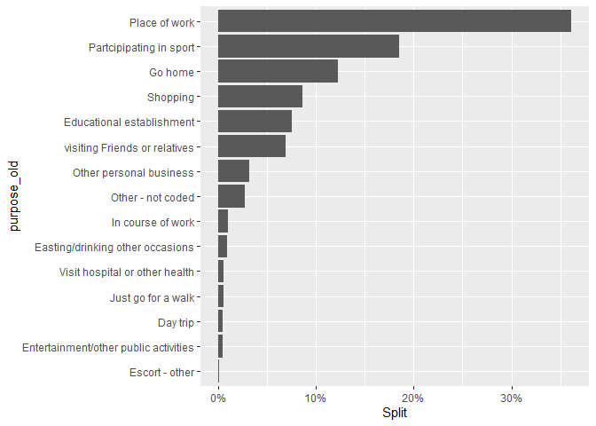
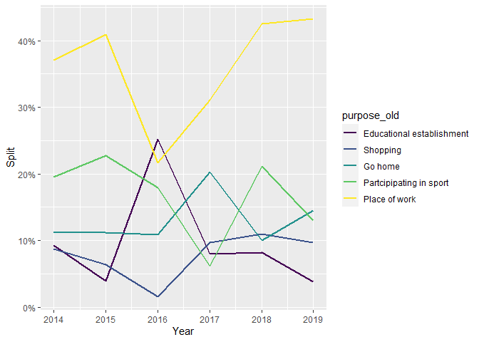
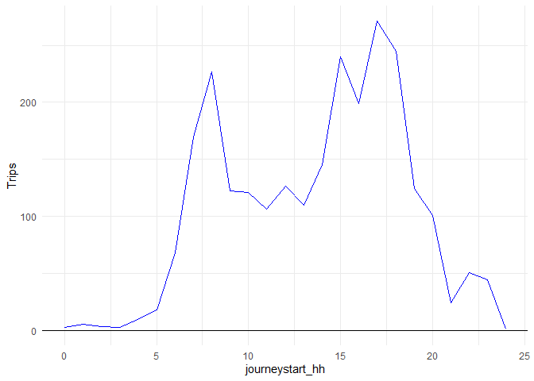
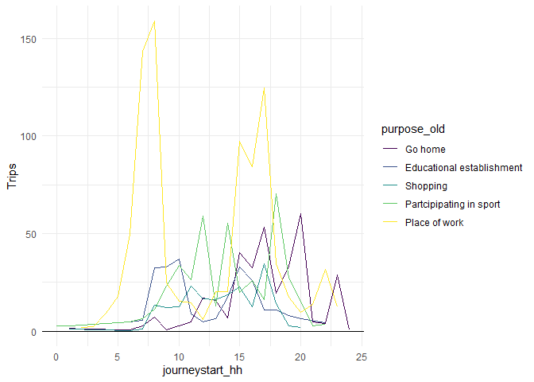

Transport and Travel - Scotish Household Survey
================

The goal of this repository is to analyse the results of the Scottish
Household Survey to obtain the mode splits.

All the zip files have been obtained from the [UK data
service](https://beta.ukdataservice.ac.uk/datacatalogue/studies/study?id=8775)

``` r
zip_files = list.files("raw_data/","\\.zip$",full.names = T)
zip_files
```

    ## [1] "raw_data/7964spss_bcc98090d92c0cad9d0e65e37ddc0591.zip"   
    ## [2] "raw_data/8168spss_7E71FE4E91FBD90B6A22931DBFB9444C_V1.zip"
    ## [3] "raw_data/8333spss_2119F1608B6E9B643BBCADDFC5E865D5_V1.zip"
    ## [4] "raw_data/8463spss_27B8A9C6A2988942DA5DF9EB6D9CCE35_V1.zip"
    ## [5] "raw_data/8617spss_EB73235EFE70CDB92AAAFBDA4A4BDBE7_V1.zip"
    ## [6] "raw_data/8775spss_647772365F41501FC26EA57EDF2A7077_V1.zip"

All the zip files are extracted with the following code:

``` r
for (file in zip_files){  
  unzip(file,exdir = "raw_data")
  }
```

Once the files have been unzipped, the files with the journey diaries
are listed as follows:

``` r
SPSS_files = list.files(pattern = "journey.*\\.sav$",
                        recursive = T,full.names = T)
SPSS_files
```

    ## [1] "./raw_data/UKDA-7964-spss/spss/spss19/shs2014_td_journey_public.sav"
    ## [2] "./raw_data/UKDA-8168-spss/spss/spss24/shs2015_td_journey_public.sav"
    ## [3] "./raw_data/UKDA-8333-spss/spss/spss24/shs2016_td_journey_public.sav"
    ## [4] "./raw_data/UKDA-8463-spss/spss/spss24/shs2017_td_journey_public.sav"
    ## [5] "./raw_data/UKDA-8617-spss/spss/spss25/shs2018_td_journey_public.sav"
    ## [6] "./raw_data/UKDA-8775-spss/spss/spss25/shs2019_td_journey_public.sav"

All files are imported

``` r
library(haven)
library(tidyverse)

data = do.call(bind_rows,lapply(SPSS_files,read_sav))

data |> head()
```

    ## # A tibble: 6 × 34
    ##   UNIQIDNEW Journey dyear       IND_WT trav_wt randsex randage randecon mainmode
    ##       <dbl>   <dbl> <dbl+lbl>    <dbl>   <dbl> <dbl+l> <dbl+l> <dbl+lb> <dbl+lb>
    ## 1   671908.       1 16 [2014 d…   1.28    1.03 1 [Mal… 44      2 [Empl… 1 [Walk…
    ## 2   671908.       2 16 [2014 d…   1.28    1.03 1 [Mal… 44      2 [Empl… 1 [Walk…
    ## 3  1513778.       1 16 [2014 d…   2.24    2.91 2 [Fem… 42      3 [Empl… 2 [Car/…
    ## 4  1513778.       2 16 [2014 d…   2.24    2.91 2 [Fem… 42      3 [Empl… 2 [Car/…
    ## 5  1513778.       3 16 [2014 d…   2.24    2.91 2 [Fem… 42      3 [Empl… 3 [Car/…
    ## 6  1513778.       4 16 [2014 d…   2.24    2.91 2 [Fem… 42      3 [Empl… 1 [Walk…
    ## # ℹ 25 more variables: purpose_new <dbl+lbl>, purpose_old <dbl+lbl>,
    ## #   journeystart_lacode <chr>, journeyend_lacode <chr>,
    ## #   JourStart_UR13 <dbl+lbl>, JourEnd_UR13 <dbl+lbl>, journeystart_time <time>,
    ## #   journeystart_hh <dbl>, journeystart_mm <dbl>, journeyend_time <time>,
    ## #   journeyend_hh <dbl>, journeyend_mm <dbl>, journey_duration <dbl>,
    ## #   journey_distance <dbl>, journeystart_sum <dbl>, journeyend_sum <dbl>,
    ## #   keepjourney <dbl+lbl>, imp_dist <dbl+lbl>, roadnet_time <dbl>, …

We are only interested in trips made by bicycle. According to the data
dictionaries, the corresponding code is `4`.

``` r
data_bicycle = data |> filter(mainmode == 4)
data_bicycle |> head()
```

    ## # A tibble: 6 × 34
    ##   UNIQIDNEW Journey dyear       IND_WT trav_wt randsex randage randecon mainmode
    ##       <dbl>   <dbl> <dbl+lbl>    <dbl>   <dbl> <dbl+l> <dbl+l> <dbl+lb> <dbl+lb>
    ## 1  1327998.       1 16 [2014 d…   1.61    1.36 1 [Mal… 46       2 [Emp… 4 [Bicy…
    ## 2  1327998.       2 16 [2014 d…   1.61    1.36 1 [Mal… 46       2 [Emp… 4 [Bicy…
    ## 3   257230.       1 16 [2014 d…   1.87    1.27 1 [Mal… 58      10 [Per… 4 [Bicy…
    ## 4   257230.       2 16 [2014 d…   1.87    1.27 1 [Mal… 58      10 [Per… 4 [Bicy…
    ## 5  1041311.       1 16 [2014 d…   1.44    1.03 1 [Mal… 77       5 [Per… 4 [Bicy…
    ## 6  1041311.       2 16 [2014 d…   1.44    1.03 1 [Mal… 77       5 [Per… 4 [Bicy…
    ## # ℹ 25 more variables: purpose_new <dbl+lbl>, purpose_old <dbl+lbl>,
    ## #   journeystart_lacode <chr>, journeyend_lacode <chr>,
    ## #   JourStart_UR13 <dbl+lbl>, JourEnd_UR13 <dbl+lbl>, journeystart_time <time>,
    ## #   journeystart_hh <dbl>, journeystart_mm <dbl>, journeyend_time <time>,
    ## #   journeyend_hh <dbl>, journeyend_mm <dbl>, journey_duration <dbl>,
    ## #   journey_distance <dbl>, journeystart_sum <dbl>, journeyend_sum <dbl>,
    ## #   keepjourney <dbl+lbl>, imp_dist <dbl+lbl>, roadnet_time <dbl>, …

We can calculate the purpose split for the bicycle trips using the
weight variables as follows:

``` r
summary_purpose = data_bicycle |>
  summarise(Trips = sum(IND_WT*trav_wt),
            .by = c(purpose_old)) |> 
  mutate(Split = Trips/sum(Trips))
summary_purpose
```

    ## # A tibble: 15 × 3
    ##    purpose_old                                 Trips    Split
    ##    <dbl+lbl>                                   <dbl>    <dbl>
    ##  1  1 [Place of work]                         909.   0.359   
    ##  2  4 [Shopping]                              202.   0.0797  
    ##  3 14 [Other - not coded]                      65.0  0.0256  
    ##  4 28 [Go home]                               334.   0.132   
    ##  5 11 [Partcipipating in sport]               419.   0.165   
    ##  6 10 [Entertainment/other public activities]   8.76 0.00345 
    ##  7  7 [visiting Friends or relatives]         192.   0.0756  
    ##  8  6 [Other personal business]                89.2  0.0352  
    ##  9 29 [Just go for a walk]                     10.0  0.00396 
    ## 10  3 [Educational establishment]             248.   0.0980  
    ## 11  5 [Visit hospital or other health]          8.60 0.00339 
    ## 12  2 [In course of work]                      17.5  0.00690 
    ## 13  9 [Easting/drinking other occasions]       18.7  0.00737 
    ## 14 13 [Day trip]                               11.9  0.00470 
    ## 15 27 [Escort - other]                          1.58 0.000625

The `summary_purpose` object has some labelled columns, that includes
the coded variables. The following code allows us to extract the labels
for the trip purposes

``` r
summary_purpose = summary_purpose |> 
  mutate(purpose_old = haven::as_factor(purpose_old))
summary_purpose
```

    ## # A tibble: 15 × 3
    ##    purpose_old                            Trips    Split
    ##    <fct>                                  <dbl>    <dbl>
    ##  1 Place of work                         909.   0.359   
    ##  2 Shopping                              202.   0.0797  
    ##  3 Other - not coded                      65.0  0.0256  
    ##  4 Go home                               334.   0.132   
    ##  5 Partcipipating in sport               419.   0.165   
    ##  6 Entertainment/other public activities   8.76 0.00345 
    ##  7 visiting Friends or relatives         192.   0.0756  
    ##  8 Other personal business                89.2  0.0352  
    ##  9 Just go for a walk                     10.0  0.00396 
    ## 10 Educational establishment             248.   0.0980  
    ## 11 Visit hospital or other health          8.60 0.00339 
    ## 12 In course of work                      17.5  0.00690 
    ## 13 Easting/drinking other occasions       18.7  0.00737 
    ## 14 Day trip                               11.9  0.00470 
    ## 15 Escort - other                          1.58 0.000625

<!-- -->

Similarly, the split by year can be calculated with the following code:

``` r
summary_purpose_year = data_bicycle |>
  summarise(Trips = sum(IND_WT*trav_wt),
            .by = c(purpose_old,dyear)) |> 
  mutate(Split = Trips/sum(Trips),.by = c(dyear))
```

The years are also a coded variable.

``` r
summary_purpose_year = summary_purpose_year |>
  mutate(purpose_old = haven::as_factor(purpose_old),
         dyear = haven::as_factor(dyear))
summary_purpose_year
```

    ## # A tibble: 74 × 4
    ##    purpose_old                           dyear                 Trips   Split
    ##    <fct>                                 <fct>                 <dbl>   <dbl>
    ##  1 Place of work                         2014 dataset/script 153.    0.371  
    ##  2 Shopping                              2014 dataset/script  36.0   0.0869 
    ##  3 Other - not coded                     2014 dataset/script  34.0   0.0821 
    ##  4 Go home                               2014 dataset/script  46.2   0.112  
    ##  5 Partcipipating in sport               2014 dataset/script  81.0   0.196  
    ##  6 Entertainment/other public activities 2014 dataset/script   0.72  0.00174
    ##  7 visiting Friends or relatives         2014 dataset/script  20.0   0.0484 
    ##  8 Other personal business               2014 dataset/script   0.488 0.00118
    ##  9 Just go for a walk                    2014 dataset/script   1.31  0.00317
    ## 10 Educational establishment             2014 dataset/script  38.4   0.0927 
    ## # ℹ 64 more rows

We can see how the splits for the five most common purposes have changed
from year to year. For this purpose, we extract the top 5 purposes from
the previous analysis.

``` r
top_5_purposes = summary_purpose |> slice_max(Split,n = 5) |> pull(purpose_old)
top_5_purposes
```

    ## [1] Place of work             Partcipipating in sport  
    ## [3] Go home                   Educational establishment
    ## [5] Shopping                 
    ## attr(,"label")
    ## [1] Purpose of journey (Old codes)
    ## 24 Levels: Not stated Place of work ... Just go for a walk

We need to remove the `dataset/script` or extract the numerical part of
the dyear column for plotting.

``` r
summary_purpose_year |> 
  filter(purpose_old %in% top_5_purposes) |> 
  mutate(Year = as.integer(str_extract(dyear,"\\d*")), 
         purpose_old = fct_reorder(purpose_old, Split)) |> 
  ggplot(aes(x = Year, y = Split, col = purpose_old)) + 
  geom_line(linewidth = 1)+
  scale_color_viridis_d()+
  scale_y_continuous(labels = scales::percent)
```

<!-- --> The high
variation of the splits might be linked to the different samples for
each year’s survey.

## Temporal Distribution of trips

Using the start time when the recorded trips (`journeystart_hh`), we can
build an hourly profile of the trips.

``` r
hourly_summary = data_bicycle |> 
  summarise(Trips = sum(IND_WT*trav_wt),
            .by = c(journeystart_hh))
hourly_summary
```

    ## # A tibble: 25 × 2
    ##    journeystart_hh Trips
    ##              <dbl> <dbl>
    ##  1               8 227. 
    ##  2              17 271. 
    ##  3               9 123. 
    ##  4               6  67.7
    ##  5               7 169. 
    ##  6              15 240. 
    ##  7              16 199. 
    ##  8              12 127. 
    ##  9              13 110. 
    ## 10              11 106. 
    ## # ℹ 15 more rows

The following code is used to plot the hourly trips profile.

``` r
hourly_summary |>
  ggplot(aes(x=journeystart_hh,y = Trips))+
    geom_line(linewidth = 0.7,col = "blue")+
  geom_hline(yintercept = 0)+
  theme_minimal()
```

<!-- --> We can also
produce the same analysis by trip purpose.

``` r
hourly_summary_purpose = data_bicycle |> 
  summarise(Trips = sum(IND_WT*trav_wt),
            .by = c(journeystart_hh,purpose_old)) |> 
  mutate(purpose_old = haven::as_factor(purpose_old))
  
hourly_summary_purpose
```

    ## # A tibble: 184 × 3
    ##    journeystart_hh purpose_old              Trips
    ##              <dbl> <fct>                    <dbl>
    ##  1               8 Place of work           159.  
    ##  2              17 Place of work           125.  
    ##  3               9 Shopping                 12.0 
    ##  4               6 Other - not coded         7.31
    ##  5               7 Other - not coded         7.31
    ##  6              15 Other - not coded         3.11
    ##  7              16 Go home                  32.3 
    ##  8              12 Partcipipating in sport  58.9 
    ##  9              13 Go home                  15.7 
    ## 10              11 Place of work            14.6 
    ## # ℹ 174 more rows

As shown in the plot below, the commuting trips have two clear peaks;
for all other purposes the patterns are less notorious.

``` r
hourly_summary_purpose |>
  filter(purpose_old %in% top_5_purposes) |>
  mutate(purpose_old = fct_reorder(purpose_old, Trips)) |> 
  ggplot(aes(x=journeystart_hh,y = Trips, col = purpose_old))+
  geom_line(linewidth = 0.7)+
  geom_hline(yintercept = 0)+
  theme_minimal()+
  scale_colour_viridis_d()
```

<!-- -->
