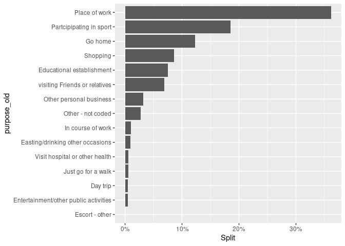
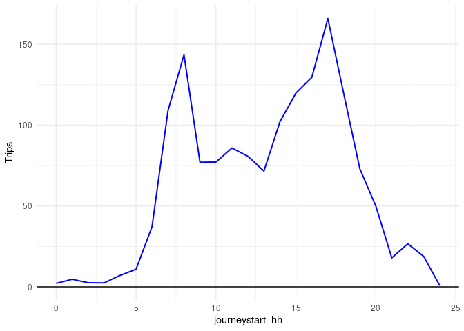
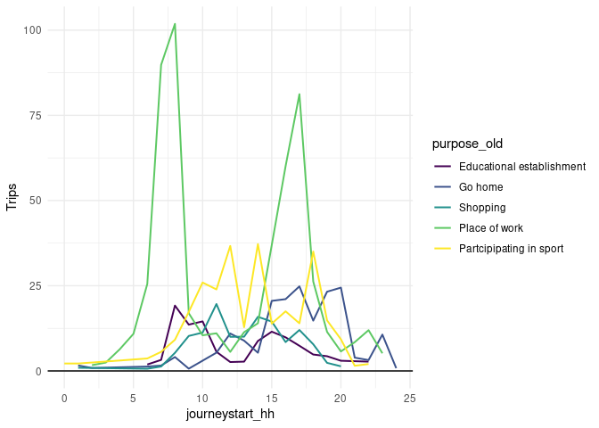
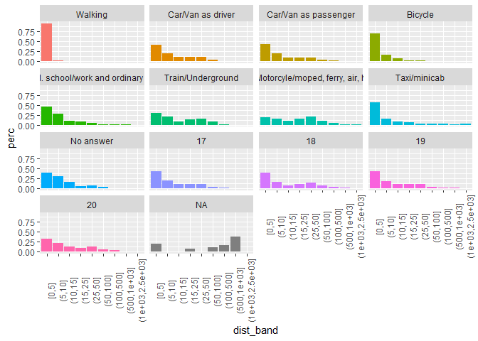

Transport and Travel - Scottish Household Survey
================

The goal of this repository is to analyse the results of the Scottish
Household Survey from 2014 to 2019 \[1\],\[2\],\[3\],\[4\],\[5\],\[6\]
to estimate the overall mode splits and temporal distribution of trips
made by bicycle. Some details on the weighting methodology of the survey
can be found
[here](https://www.gov.scot/publications/scottish-household-survey-2021-methodology-fieldwork-outcomes/pages/7/)

All the zip files have been obtained from the [UK data
service](https://beta.ukdataservice.ac.uk/datacatalogue/studies/study?id=8775)

First of all, a copy of the original files can be obtained with the code
below. This code is to be run just once.

``` r
dir.create("raw_data")
system("gh release download 1 --dir raw_data")
```

We can list the files with the following code:

``` r
zip_files = list.files("raw_data/","\\.zip$",full.names = T)
zip_files
```

    ## [1] "raw_data/7964spss_bcc98090d92c0cad9d0e65e37ddc0591.zip"   
    ## [2] "raw_data/8168spss_7E71FE4E91FBD90B6A22931DBFB9444C_V1.zip"
    ## [3] "raw_data/8333spss_2119F1608B6E9B643BBCADDFC5E865D5_V1.zip"
    ## [4] "raw_data/8463spss_27B8A9C6A2988942DA5DF9EB6D9CCE35_V1.zip"
    ## [5] "raw_data/8617spss_EB73235EFE70CDB92AAAFBDA4A4BDBE7_V1.zip"
    ## [6] "raw_data/8775spss_647772365F41501FC26EA57EDF2A7077_V1.zip"

All the zipped files are extracted with the following code:

``` r
for (file in zip_files){  
  unzip(file,exdir = "raw_data")
  }
```

Once the files have been unzipped, the `*.sav` files containing the
journey diaries are listed as follows:

``` r
SPSS_files = list.files(pattern = "journey.*\\.sav$",
                        recursive = T,full.names = T)
SPSS_files
```

    ## [1] "./raw_data/UKDA-7964-spss/spss/spss19/shs2014_td_journey_public.sav"
    ## [2] "./raw_data/UKDA-8168-spss/spss/spss24/shs2015_td_journey_public.sav"
    ## [3] "./raw_data/UKDA-8333-spss/spss/spss24/shs2016_td_journey_public.sav"
    ## [4] "./raw_data/UKDA-8463-spss/spss/spss24/shs2017_td_journey_public.sav"
    ## [5] "./raw_data/UKDA-8617-spss/spss/spss25/shs2018_td_journey_public.sav"
    ## [6] "./raw_data/UKDA-8775-spss/spss/spss25/shs2019_td_journey_public.sav"

All files are imported using the `haven` library with this code:

``` r
library(haven)
library(tidyverse)
library(kableExtra)

data = do.call(bind_rows,lapply(SPSS_files,read_sav))

data |> head()
```

    ## # A tibble: 6 × 34
    ##   UNIQIDNEW Journey dyear       IND_WT trav_wt randsex randage randecon mainmode
    ##       <dbl>   <dbl> <dbl+lbl>    <dbl>   <dbl> <dbl+l> <dbl+l> <dbl+lb> <dbl+lb>
    ## 1   671908.       1 16 [2014 d…   1.28    1.03 1 [Mal… 44      2 [Empl… 1 [Walk…
    ## 2   671908.       2 16 [2014 d…   1.28    1.03 1 [Mal… 44      2 [Empl… 1 [Walk…
    ## 3  1513778.       1 16 [2014 d…   2.24    2.91 2 [Fem… 42      3 [Empl… 2 [Car/…
    ## 4  1513778.       2 16 [2014 d…   2.24    2.91 2 [Fem… 42      3 [Empl… 2 [Car/…
    ## 5  1513778.       3 16 [2014 d…   2.24    2.91 2 [Fem… 42      3 [Empl… 3 [Car/…
    ## 6  1513778.       4 16 [2014 d…   2.24    2.91 2 [Fem… 42      3 [Empl… 1 [Walk…
    ## # ℹ 25 more variables: purpose_new <dbl+lbl>, purpose_old <dbl+lbl>,
    ## #   journeystart_lacode <chr>, journeyend_lacode <chr>,
    ## #   JourStart_UR13 <dbl+lbl>, JourEnd_UR13 <dbl+lbl>, journeystart_time <time>,
    ## #   journeystart_hh <dbl>, journeystart_mm <dbl>, journeyend_time <time>,
    ## #   journeyend_hh <dbl>, journeyend_mm <dbl>, journey_duration <dbl>,
    ## #   journey_distance <dbl>, journeystart_sum <dbl>, journeyend_sum <dbl>,
    ## #   keepjourney <dbl+lbl>, imp_dist <dbl+lbl>, roadnet_time <dbl>, …

We are only interested in trips made by bicycle. According to the data
dictionaries, the corresponding code is `4`.

``` r
data_bicycle = data |> filter(mainmode == 4)
data_bicycle |> head()
```

    ## # A tibble: 6 × 34
    ##   UNIQIDNEW Journey dyear       IND_WT trav_wt randsex randage randecon mainmode
    ##       <dbl>   <dbl> <dbl+lbl>    <dbl>   <dbl> <dbl+l> <dbl+l> <dbl+lb> <dbl+lb>
    ## 1  1327998.       1 16 [2014 d…   1.61    1.36 1 [Mal… 46       2 [Emp… 4 [Bicy…
    ## 2  1327998.       2 16 [2014 d…   1.61    1.36 1 [Mal… 46       2 [Emp… 4 [Bicy…
    ## 3   257230.       1 16 [2014 d…   1.87    1.27 1 [Mal… 58      10 [Per… 4 [Bicy…
    ## 4   257230.       2 16 [2014 d…   1.87    1.27 1 [Mal… 58      10 [Per… 4 [Bicy…
    ## 5  1041311.       1 16 [2014 d…   1.44    1.03 1 [Mal… 77       5 [Per… 4 [Bicy…
    ## 6  1041311.       2 16 [2014 d…   1.44    1.03 1 [Mal… 77       5 [Per… 4 [Bicy…
    ## # ℹ 25 more variables: purpose_new <dbl+lbl>, purpose_old <dbl+lbl>,
    ## #   journeystart_lacode <chr>, journeyend_lacode <chr>,
    ## #   JourStart_UR13 <dbl+lbl>, JourEnd_UR13 <dbl+lbl>, journeystart_time <time>,
    ## #   journeystart_hh <dbl>, journeystart_mm <dbl>, journeyend_time <time>,
    ## #   journeyend_hh <dbl>, journeyend_mm <dbl>, journey_duration <dbl>,
    ## #   journey_distance <dbl>, journeystart_sum <dbl>, journeyend_sum <dbl>,
    ## #   keepjourney <dbl+lbl>, imp_dist <dbl+lbl>, roadnet_time <dbl>, …

We can calculate the purpose split for the bicycle trips using the
weight variables as follows:

``` r
summary_purpose = data_bicycle |>
  summarise(Trips = sum(trav_wt),
            .by = c(purpose_old)) |> 
  mutate(Split = Trips/sum(Trips))
summary_purpose
```

    ## # A tibble: 15 × 3
    ##    purpose_old                                 Trips    Split
    ##    <dbl+lbl>                                   <dbl>    <dbl>
    ##  1  1 [Place of work]                         555.   0.361   
    ##  2  4 [Shopping]                              132.   0.0858  
    ##  3 14 [Other - not coded]                      42.1  0.0274  
    ##  4 28 [Go home]                               188.   0.123   
    ##  5 11 [Partcipipating in sport]               285.   0.185   
    ##  6 10 [Entertainment/other public activities]   7.1  0.00462 
    ##  7  7 [visiting Friends or relatives]         106.   0.0692  
    ##  8  6 [Other personal business]                48.3  0.0315  
    ##  9 29 [Just go for a walk]                      8.44 0.00550 
    ## 10  3 [Educational establishment]             116.   0.0754  
    ## 11  5 [Visit hospital or other health]          8.9  0.00580 
    ## 12  2 [In course of work]                      15.9  0.0104  
    ## 13  9 [Easting/drinking other occasions]       14.1  0.00917 
    ## 14 13 [Day trip]                                7.7  0.00501 
    ## 15 27 [Escort - other]                          1.15 0.000749

The `summary_purpose` object has coded variables which are stored as
labelled vectors. The following code allows us to extract the labels
from the `purpose_old` column.

``` r
summary_purpose = summary_purpose |> 
  mutate(purpose_old = haven::as_factor(purpose_old))
summary_purpose
```

    ## # A tibble: 15 × 3
    ##    purpose_old                            Trips    Split
    ##    <fct>                                  <dbl>    <dbl>
    ##  1 Place of work                         555.   0.361   
    ##  2 Shopping                              132.   0.0858  
    ##  3 Other - not coded                      42.1  0.0274  
    ##  4 Go home                               188.   0.123   
    ##  5 Partcipipating in sport               285.   0.185   
    ##  6 Entertainment/other public activities   7.1  0.00462 
    ##  7 visiting Friends or relatives         106.   0.0692  
    ##  8 Other personal business                48.3  0.0315  
    ##  9 Just go for a walk                      8.44 0.00550 
    ## 10 Educational establishment             116.   0.0754  
    ## 11 Visit hospital or other health          8.9  0.00580 
    ## 12 In course of work                      15.9  0.0104  
    ## 13 Easting/drinking other occasions       14.1  0.00917 
    ## 14 Day trip                                7.7  0.00501 
    ## 15 Escort - other                          1.15 0.000749

<!-- -->

Similarly, the split by year can be calculated with the following code:

``` r
summary_purpose_year = data_bicycle |>
  summarise(Trips = sum(trav_wt),
            .by = c(purpose_old,dyear)) |> 
  mutate(Split = Trips/sum(Trips),.by = c(dyear))
```

The years are also a coded variable.

``` r
summary_purpose_year = summary_purpose_year |>
  mutate(purpose_old = haven::as_factor(purpose_old),
         dyear = haven::as_factor(dyear))
summary_purpose_year
```

    ## # A tibble: 74 × 4
    ##    purpose_old                           dyear                Trips   Split
    ##    <fct>                                 <fct>                <dbl>   <dbl>
    ##  1 Place of work                         2014 dataset/script 102.   0.352  
    ##  2 Shopping                              2014 dataset/script  32.3  0.112  
    ##  3 Other - not coded                     2014 dataset/script  21.7  0.0753 
    ##  4 Go home                               2014 dataset/script  31.7  0.110  
    ##  5 Partcipipating in sport               2014 dataset/script  58    0.201  
    ##  6 Entertainment/other public activities 2014 dataset/script   0.75 0.00260
    ##  7 visiting Friends or relatives         2014 dataset/script  15.3  0.0529 
    ##  8 Other personal business               2014 dataset/script   1.04 0.00360
    ##  9 Just go for a walk                    2014 dataset/script   1.44 0.00499
    ## 10 Educational establishment             2014 dataset/script  21.7  0.0753 
    ## # ℹ 64 more rows

We can see how the splits for the five most common purposes have changed
from year to year. For this purpose, we extract the top 5 purposes from
the previous analysis.

``` r
top_5_purposes = summary_purpose |> slice_max(Split,n = 5) |> pull(purpose_old)
top_5_purposes
```

    ## [1] Place of work             Partcipipating in sport  
    ## [3] Go home                   Shopping                 
    ## [5] Educational establishment
    ## attr(,"label")
    ## [1] Purpose of journey (Old codes)
    ## 24 Levels: Not stated Place of work ... Just go for a walk

We need to remove the `dataset/script` or extract the numerical part of
the dyear column for plotting.

``` r
summary_purpose_year |> 
  filter(purpose_old %in% top_5_purposes) |> 
  mutate(Year = as.integer(str_extract(dyear,"\\d*")), 
         purpose_old = fct_reorder(purpose_old, Split)) |> 
  ggplot(aes(x = Year, y = Split, col = purpose_old)) + 
  geom_line(linewidth = 1)+
  scale_color_viridis_d()+
  scale_y_continuous(labels = scales::percent)
```

<!-- -->

The high variation of the splits might be linked to the different
samples for each year’s survey.

## Temporal Distribution of trips

Using the start time when the recorded trips (`journeystart_hh`), we can
build an hourly profile of the trips.

``` r
hourly_summary = data_bicycle |> 
  summarise(Trips = sum(trav_wt),
            .by = c(journeystart_hh))
hourly_summary
```

    ## # A tibble: 25 × 2
    ##    journeystart_hh Trips
    ##              <dbl> <dbl>
    ##  1               8 144. 
    ##  2              17 166. 
    ##  3               9  77.0
    ##  4               6  37.2
    ##  5               7 109. 
    ##  6              15 120. 
    ##  7              16 130. 
    ##  8              12  80.7
    ##  9              13  71.6
    ## 10              11  85.8
    ## # ℹ 15 more rows

The following code is used to plot the hourly trips profile.

``` r
hourly_summary |>
  ggplot(aes(x=journeystart_hh,y = Trips))+
    geom_line(linewidth = 0.7,col = "blue")+
  geom_hline(yintercept = 0)+
  theme_minimal()
```

<!-- -->

We can also produce the same analysis by trip purpose.

``` r
hourly_summary_purpose = data_bicycle |> 
  summarise(Trips = sum(trav_wt),
            .by = c(journeystart_hh,purpose_old)) |> 
  mutate(purpose_old = haven::as_factor(purpose_old))
  
hourly_summary_purpose
```

    ## # A tibble: 184 × 3
    ##    journeystart_hh purpose_old              Trips
    ##              <dbl> <fct>                    <dbl>
    ##  1               8 Place of work           102.  
    ##  2              17 Place of work            81.2 
    ##  3               9 Shopping                 10.3 
    ##  4               6 Other - not coded         3.86
    ##  5               7 Other - not coded         3.86
    ##  6              15 Other - not coded         2.13
    ##  7              16 Go home                  21.1 
    ##  8              12 Partcipipating in sport  36.7 
    ##  9              13 Go home                   8.89
    ## 10              11 Place of work            11.0 
    ## # ℹ 174 more rows

As shown in the plot below, the *commuting* and *education* trips have
two clear peaks; for all other purposes the temporal patterns are less
clear.

``` r
hourly_summary_purpose |>
  filter(purpose_old %in% top_5_purposes) |>
  mutate(purpose_old = fct_reorder(purpose_old, Trips)) |> 
  ggplot(aes(x=journeystart_hh,y = Trips, col = purpose_old))+
  geom_line(linewidth = 0.7)+
  geom_hline(yintercept = 0)+
  theme_minimal()+
  scale_colour_viridis_d()
```

<!-- -->

## Trip Length Distribution

The following section includes a brief analysis of the trip length
distribution. For this analysis, the following distance bands are
defined (in km)

``` r
tld_bands = c(0,5,10,15,25,50,100,500,1000,2500)
```

### By mode

``` r
TLD_mode = data |> 
  mutate(dist_band = cut(roadnet_kms,
                         breaks = tld_bands,
                         include.lowest = T),
         ) |>
  summarise(Trips = sum(trav_wt,na.rm = T),
            .by = c(mainmode,dist_band)) |> 
  mutate(perc = Trips/sum(Trips),
         .by = c(mainmode))
```

``` r
TLD_mode |> 
  drop_na(dist_band) |> 
  ggplot(aes(x=dist_band,y=perc,fill=haven::as_factor(mainmode)))+
  geom_col()+
  facet_wrap(haven::as_factor(mainmode)~.)+
  theme(legend.position = "none",
        axis.text.x = element_text(angle = 90))
```

<!-- -->

### By purpose

The following exercise uses the `purpose_old` categories. A finer
analysis is possible if the `purpose_new` and `purpose_new2`

``` r
TLD_purpose = data |>
  mutate(dist_band = cut(roadnet_kms,
                         breaks = tld_bands,
                         include.lowest = T),
         ) |>
  drop_na(dist_band) |> 
  summarise(Trips = sum(trav_wt,na.rm = T),
            .by = c(purpose_old,dist_band)) |> 
  mutate(perc_band = Trips/sum(Trips),
         .by = c(purpose_old)) |> 
  mutate(perc_purp = Trips/sum(Trips),
         .by = c(dist_band))
```

``` r
TLD_purpose |> 
  ggplot(aes(x=dist_band,y=perc_purp,fill=haven::as_factor(purpose_old)))+
  geom_col(position = "fill")+
  scale_y_continuous(labels = scales::percent_format())+
  theme(legend.position = "bottom",
        axis.text.x = element_text(angle = 90))
```

<!-- -->

``` r
TLD_purpose |> 
  ggplot(aes(x=dist_band,y=perc_purp,fill=haven::as_factor(purpose_old)))+
  geom_col()+
  scale_y_continuous(labels = scales::percent_format())+
  facet_wrap(haven::as_factor(purpose_old)~.)+
  theme(legend.position = "none",
        axis.text.x = element_text(angle = 90))
```

<!-- -->

### By mode and purpose

``` r
TLD_mode_purp = data |> 
  mutate(dist_band = cut(roadnet_kms,
                         breaks = tld_bands,
                         include.lowest = T),
         ) |>
  summarise(Trips = sum(trav_wt,na.rm = T),
            .by = c(mainmode,purpose_old,dist_band)) |> 
  mutate(perc = Trips/sum(Trips),
         .by = c(mainmode,purpose_old))
```

``` r
TLD_mode_purp |> 
  drop_na(dist_band, mainmode) |> 
  filter(mainmode<9) |> 
  ggplot(aes(x=dist_band,y=perc,fill=haven::as_factor(purpose_old)))+
  geom_col()+
  facet_wrap(haven::as_factor(mainmode)~.)+
  theme(legend.position = "bottom",
        axis.text.x = element_text(angle = 90))
```

<!-- -->

## Annualisation factors calculation

In order to estimate the trip frequency by purpose, . The following code
loads the data into the environment which contains the stage tables from
the survey.

``` r
SPSS_files_stage = list.files(pattern = "stage.*\\.sav$",
                        recursive = T,full.names = T)

data.stage = do.call(bind_rows,lapply(SPSS_files_stage,read_sav))
```

### Bike baseline

As in the previous analysis, we are interested only in the bicycle trips
(`mode` = `4`). Although bike might not be the main mode for all the
trip, all bike stages are considered for this analysis. Subsequently, we
select the columns of interest

``` r
bike_stages <- data.stage |> 
  filter(sum(mode == 4)>0,.by = c(UNIQIDNEW,dyear,trav_wt,travday)) |> 
  select(mode,UNIQIDNEW,dyear,IND_WT,trav_wt,purpose_new,travday)
```

Firstly, we explore the overall trip frequency splits by day of the week

``` r
bike_stages |> 
  filter(mode ==4) |> 
  summarise(Total = sum(trav_wt,na.rm = T),
            .by = c(dyear,travday)) |> 
  mutate(Perc = Total/sum(Total),
         .by = c(dyear)) |> 
  select(-Total) |> 
  ggplot(aes(x=haven::as_factor(dyear), y = Perc, fill = haven::as_factor(travday)))+
  scale_y_continuous(
    # limits = c(0,0.3),
    labels = scales::percent)+
  geom_col()+
  scale_fill_viridis_d()+
  theme_minimal()+
  theme(axis.text.x = element_text(angle = 30,vjust = 1,hjust = 1))+
  labs(x= "year/dataset",y=NULL,fill = "Day",title = "Portion of trips by day of travel")
```

<!-- -->

``` r
bike_stages |> 
  filter(mode ==4) |> 
  summarise(Total = sum(trav_wt,na.rm = T),
            .by = c(dyear,travday)) |> 
  mutate(Perc = Total/sum(Total),
         .by = c(dyear)) |> 
  select(-Total) |> 
  ggplot(aes(x="Overall", y = Perc/sum(Perc), fill = haven::as_factor(travday)))+
  scale_y_continuous(
    # limits = c(0,0.3),
    labels = scales::percent)+
  geom_col()+
  scale_fill_viridis_d()+
  theme_minimal()+
  theme(axis.text.x = element_text(angle = 30,vjust = 1,hjust = 1),legend.position = "bottom")+
  labs(x= NULL,
       y=NULL,fill = "Day",title = "Portion of trips by day of travel")+
  coord_flip()
```

<!-- -->

Since travel patters and frequency would vary among trip purposes, we
need to produce a more disaggregated analysis. Thus, we first define
groups of trip purposes from the `new_purpose` column. The following
code identifies the different trip purposes that people logged in their
trip diaries of the survey when using the bike.

``` r
SHS_purposes_bike <- bike_stages |>
  select(purpose_new) |>
  unique() |> 
  mutate(p.label = as_factor(purpose_new))
```

, A correspondence between trip purposes for the NPT project has been
defined as follows:

``` r
NPT_purposes_equiv <- tribble(
  ~ purpose_new,  ~ NPT_purpose,
  3, 'Commute',
  103, 'Commute',
  4, 'Shopping',
  104, 'Shopping',
  15, 'Other',
  29, 'Other',
  129, 'Other',
  1, 'Other',
  115, 'Other',
  34, 'Leisure',
  6, 'Visiting',
  19, 'Other',
  24, 'Other',
  106, 'Visiting',
  5, 'Visiting',
  105, 'Visiting',
  12, 'Leisure',
  112, 'Leisure',
  11, 'School',
  111, 'School',
  30, 'Other',
  130, 'Other',
  23, 'Other',
  123, 'Other',
  7, 'School',
  107, 'School',
  2, 'Other',
  102, 'Other',
  36, 'Other',
  31, 'Other',
  131, 'Other',
  119, 'Other',
  35, 'Other',
  26, 'Leisure',
  126, 'Leisure',
  25, 'Leisure',
  125, 'Leisure',
  17, 'Other',
  22, 'Other',
  122, 'Other',
  135, 'Other',
  124, 'Other',
  33, 'Other',
  136, 'Other',
  117, 'Other',
  226, 'Leisure',
  18, 'Other',
  118, 'Other',
  13, 'Other',
  113, 'Other',
  133, 'Other',
  114, 'Leisure',
  134, 'Leisure'
)
```

The following table shows how the `new_purpose` values have been grouped
into 6 wider categories:

``` r
tbl_purposes <- SHS_purposes_bike |>
  left_join(NPT_purposes_equiv,by = "purpose_new") |>
  arrange(NPT_purpose) 

kable(tbl_purposes |>
                       select(-NPT_purpose)) |>
  pack_rows(index = table(tbl_purposes$NPT_purpose)) |> 
  kable_classic(full_width = F) |>
  as_image(width = 10,file = "README_files/figure-gfm/purpose_table.png")
```


Based on this purposes, we can produce a plot for proportion of trips by
day of travel for each dataset

``` r
bike_stages |> 
  filter(mode ==4) |>
left_join(NPT_purposes_equiv,by = "purpose_new") |>    
  summarise(Total = sum(trav_wt,na.rm = T),
            .by = c(dyear,travday,NPT_purpose)) |> 
  mutate(Perc = Total/sum(Total),
         .by = c(dyear,NPT_purpose)) |> 
  select(-Total) |> 
  ggplot(aes(x=haven::as_factor(dyear), y = Perc, fill = haven::as_factor(travday)))+
  scale_y_continuous(
    # limits = c(0,0.3),
    labels = scales::percent)+
  geom_col()+
  facet_wrap(NPT_purpose~.)+
  scale_fill_viridis_d()+
  theme_minimal()+
  theme(axis.text.x = element_text(angle = 30,vjust = 1,hjust = 1))+
  labs(x= "year/dataset",y=NULL,fill = "Day",title = "Portion of trips by day of travel")
```

<!-- -->

Similarly, an the overall day of travel and purpose splits can be
visualised with the following code

``` r
bike_stages |> 
  filter(mode ==4)|> 
left_join(NPT_purposes_equiv,by = "purpose_new") |>    
  summarise(Total = sum(trav_wt,na.rm = T),
            .by = c(travday,NPT_purpose)) |> 
  mutate(Perc = Total/sum(Total),
         .by = c(NPT_purpose)) |> 
  select(-Total) |> 
  ggplot(aes(x = NPT_purpose, y = Perc, groups = NPT_purpose, fill = haven::as_factor(travday)))+
  scale_y_continuous(
    # limits = c(0,0.3),
    labels = scales::percent)+
  geom_col()+
  # facet_wrap(NPT_purpose~.)+
  scale_fill_viridis_d()+
  theme_minimal()+
  theme(axis.text.x = element_text(angle = 30,vjust = 1,hjust = 1))+
  labs(x= "year/dataset",y=NULL,fill = "Day",title = "Portion of trips by day of travel")
```

<!-- -->

``` r
bike_stages |> 
  filter(mode ==4) |> 
left_join(NPT_purposes_equiv,by = "purpose_new") |>    
  summarise(Total = sum(trav_wt,na.rm = T),
            .by = c(travday,NPT_purpose)) |> 
  mutate(Perc = Total/sum(Total),
         .by = c(travday)) |> 
  select(-Total) |> 
  ggplot(aes(x = haven::as_factor(travday), y = Perc, fill = NPT_purpose))+
  scale_y_continuous(
    # limits = c(0,0.3),
    labels = scales::percent)+
  geom_col()+
  # facet_wrap(NPT_purpose~.)+
  scale_fill_brewer(palette = "Set2")+
  theme_minimal()+
  theme(axis.text.x = element_text(angle = 30,vjust = 1,hjust = 1))+
  labs(x= "year/dataset",y=NULL,fill = "Day",title = "Portion of trips by day of travel made by bike")
```

<!-- -->

In order to produce the annualisation factors, we have to estimate the
trip frequency by purpose from the survey. First the number of trips by
day of the week is calculated for each respondent of the survey. Then,
we calculate the weighted mean all respondents using the travel diary
weight (`trav_wt`). This calculations are applied by each category of
the NTP purposes.

``` r
purpose_trips_bike_BL = bike_stages |> 
  filter(mode ==4) |>
  left_join(NPT_purposes_equiv,by = "purpose_new") |> 
  summarise(N_trips = n(),
            .by = c(dyear,travday,UNIQIDNEW,NPT_purpose,trav_wt)) |> 
  summarise(N_trips = sum(N_trips*trav_wt,na.rm = T),
            .by = c(dyear,NPT_purpose,travday))

total_respondents_bike_BL = bike_stages |>
  select(dyear,UNIQIDNEW,trav_wt,travday) |> 
  unique() |> 
  summarise(N_ind = sum(trav_wt,na.rm = T),
            .by = c(dyear,travday))

N_bar_daily_BL = purpose_trips_bike_BL |> 
  left_join(total_respondents_bike_BL,
            by=join_by(dyear,travday)) |> 
  mutate(N_bar = N_trips/N_ind) |> 
  summarise(across(N_bar,mean,na.rm = T),.by = c(NPT_purpose,travday)) |> 
  arrange(NPT_purpose,travday)

N_bar_daily_BL |>
  pivot_wider(names_from = NPT_purpose,
              values_from = N_bar,
              values_fill = 0) |>
  arrange(travday)
```

    ## # A tibble: 7 × 7
    ##   travday       Commute Leisure Other School Shopping Visiting
    ##   <dbl+lbl>       <dbl>   <dbl> <dbl>  <dbl>    <dbl>    <dbl>
    ## 1 1 [Monday]      0.947  0.0851 0.675  0.167    0.116   0.214 
    ## 2 2 [Tuesday]     0.855  0.101  0.755  0.327    0.151   0.122 
    ## 3 3 [Wednesday]   0.870  0.157  0.774  0.125    0.247   0.159 
    ## 4 4 [Thursday]    0.972  0.0461 0.924  0.380    0.126   0.0866
    ## 5 5 [Friday]      1.00   0.0556 0.633  0.361    0.184   0.270 
    ## 6 6 [Saturday]    0.279  0.0841 1.27   0        0.412   0.420 
    ## 7 7 [Sunday]      0.463  0.193  1.04   0.243    0.297   0.128

In order to consider the different weights of each type of day in a year
i.e., the total number of Mondays, Tuesdays, etc; days are grouped into
weekdays, Saturdays and Sundays/bank holidays. Finally, assuming that
every year in Scotland has 250 weekdays, 52 Saturdays and 63
Sundays/Bank holidays, we calculate the annualisation factor for each
trip purpose.

``` r
AADT_factors_bike_BL <- N_bar_daily_BL |>
  mutate(d.weight = case_when(travday < 6 ~ 50,
                              travday == 6 ~ 52,
                              travday == 7 ~ 63)) |>
  summarise(AADT_bike = weighted.mean(N_bar, w = d.weight),
            .by = NPT_purpose)

AADT_factors_bike_BL |>
  mutate(weekly_trips = AADT_bike*7)
```

    ## # A tibble: 6 × 3
    ##   NPT_purpose AADT_bike weekly_trips
    ##   <chr>           <dbl>        <dbl>
    ## 1 Commute         0.756        5.29 
    ## 2 Leisure         0.106        0.744
    ## 3 Other           0.875        6.12 
    ## 4 School          0.266        1.86 
    ## 5 Shopping        0.223        1.56 
    ## 6 Visiting        0.199        1.39

***NOTE:*** The commute trip rate is normalised for all adult population
i.e., employed + unemployed.

### All modes AADT

A similar analysis is undertaken for all modes to estimate the trip
frequency across all modes for different purposes

``` r
purpose_trips_all = data.stage |>
  left_join(NPT_purposes_equiv,by = "purpose_new") |> 
  mutate(NPT_purpose = if_else(is.na(NPT_purpose),"Other",NPT_purpose)) |> 
  summarise(N_trips = n(),
            .by = c(dyear,travday,UNIQIDNEW,NPT_purpose,trav_wt)) |> 
  summarise(N_trips = sum(N_trips*trav_wt,na.rm = T),
            .by = c(dyear,NPT_purpose,travday))

total_respondents_all = data.stage |>
  select(dyear,UNIQIDNEW,trav_wt,travday) |> 
  unique() |> 
  summarise(N_ind = sum(trav_wt,na.rm = T),
            .by = c(dyear,travday))

N_bar_daily_all = purpose_trips_all |> 
  left_join(total_respondents_all,
            by=join_by(dyear,travday)) |> 
  mutate(N_bar = N_trips/N_ind) |> 
  summarise(across(N_bar,mean,na.rm = T),.by = c(NPT_purpose,travday)) |> 
  arrange(NPT_purpose,travday)

N_bar_daily_all |>
  pivot_wider(names_from = NPT_purpose,
              values_from = N_bar,
              values_fill = 0) |>
  arrange(travday)
```

    ## # A tibble: 7 × 7
    ##   travday       Commute Leisure Other School Shopping Visiting
    ##   <dbl+lbl>       <dbl>   <dbl> <dbl>  <dbl>    <dbl>    <dbl>
    ## 1 1 [Monday]      0.754   0.174 0.865 0.211     0.541    0.210
    ## 2 2 [Tuesday]     0.784   0.157 0.884 0.209     0.509    0.207
    ## 3 3 [Wednesday]   0.803   0.172 0.898 0.209     0.511    0.206
    ## 4 4 [Thursday]    0.799   0.170 0.898 0.209     0.513    0.216
    ## 5 5 [Friday]      0.803   0.191 0.901 0.195     0.561    0.259
    ## 6 6 [Saturday]    0.240   0.274 0.882 0.0140    0.902    0.367
    ## 7 7 [Sunday]      0.231   0.301 0.968 0.0178    0.648    0.413

``` r
AADT_factors_all <- N_bar_daily_all |>
  mutate(d.weight = case_when(travday < 6 ~ 50,
                              travday == 6 ~ 52,
                              travday == 7 ~ 63)) |>
  summarise(AADT_all = weighted.mean(N_bar, w = d.weight),
            .by = NPT_purpose)

AADT_factors_all |>
  mutate(weekly_trips = AADT_all*7)
```

    ## # A tibble: 6 × 3
    ##   NPT_purpose AADT_all weekly_trips
    ##   <chr>          <dbl>        <dbl>
    ## 1 Commute        0.614         4.30
    ## 2 Leisure        0.209         1.46
    ## 3 Other          0.902         6.31
    ## 4 School         0.147         1.03
    ## 5 Shopping       0.601         4.21
    ## 6 Visiting       0.274         1.92

***NOTE:*** The commute trip rate is normalised for all adult population
i.e., employed + unemployed.

### Commute

The same approach as in the previous section is followed for the
commuting trips, the only difference is that in this case only the
employed population is considered.

#### Bike BL commute

``` r
bike_stages_employed <- data.stage |>
  filter(between(randecon, 1, 3) | randecon == 9) |>
  filter(sum(mode == 4) > 0,
         .by = c(UNIQIDNEW, dyear, trav_wt, travday)) |>
  select(mode,UNIQIDNEW,dyear,IND_WT,trav_wt,purpose_new,travday)
```

``` r
purpose_trips_bike_BL_employed = bike_stages_employed |>
  filter(mode == 4) |>
  left_join(NPT_purposes_equiv, by = "purpose_new") |>
  filter(NPT_purpose == "Commute") |>
  summarise(
    N_trips = n(),
    .by = c(dyear, travday, UNIQIDNEW, NPT_purpose, trav_wt)
  ) |>
  summarise(
    N_trips = sum(N_trips * trav_wt, na.rm = T),
    .by = c(dyear, NPT_purpose, travday)
  )

total_respondents_bike_BL_employed = bike_stages_employed |>
  select(dyear, UNIQIDNEW, trav_wt, travday) |>
  unique() |>
  summarise(N_ind = sum(trav_wt, na.rm = T),
            .by = c(dyear, travday))

N_bar_daily_BL_employed = purpose_trips_bike_BL_employed |>
  left_join(total_respondents_bike_BL,
            by = join_by(dyear, travday)) |>
  mutate(N_bar = N_trips / N_ind) |>
  summarise(across(N_bar, mean, na.rm = T), .by = c(NPT_purpose, travday)) |>
  arrange(NPT_purpose, travday)

N_bar_daily_BL_employed |>
  pivot_wider(names_from = NPT_purpose,
              values_from = N_bar,
              values_fill = 0) |>
  arrange(travday)
```

    ## # A tibble: 7 × 2
    ##   travday       Commute
    ##   <dbl+lbl>       <dbl>
    ## 1 1 [Monday]      0.944
    ## 2 2 [Tuesday]     0.795
    ## 3 3 [Wednesday]   0.891
    ## 4 4 [Thursday]    0.884
    ## 5 5 [Friday]      1.10 
    ## 6 6 [Saturday]    0.289
    ## 7 7 [Sunday]      0.359

``` r
AADT_factors_bike_BL_employed <- N_bar_daily_BL_employed |>
  mutate(d.weight = case_when(travday < 6 ~ 50,
                              travday == 6 ~ 52,
                              travday == 7 ~ 63)) |>
  summarise(AADT_bike = weighted.mean(N_bar, w = d.weight),
            .by = NPT_purpose)

AADT_factors_bike_BL_employed |>
  mutate(weekly_trips = AADT_bike*7)
```

    ## # A tibble: 1 × 3
    ##   NPT_purpose AADT_bike weekly_trips
    ##   <chr>           <dbl>        <dbl>
    ## 1 Commute         0.735         5.14

#### All modes commute

``` r
Commute_trips_employed = data.stage |>
  filter(between(randecon, 1, 3) | randecon == 9) |>
  left_join(NPT_purposes_equiv, by = "purpose_new") |>
  filter(NPT_purpose == "Commute") |>
  summarise(
    N_trips = n(),
    .by = c(dyear,
            travday,
            UNIQIDNEW,
            NPT_purpose, trav_wt)
  ) |>
  summarise(
    N_trips = sum(N_trips * trav_wt, na.rm = T),
    .by = c(dyear, NPT_purpose, travday)
  )

total_respondents_all = data.stage |>
  filter(between(randecon, 1, 3) | randecon == 9) |>
  select(dyear, UNIQIDNEW, trav_wt, travday) |>
  unique() |>
  summarise(N_ind = sum(trav_wt, na.rm = T),
            .by = c(dyear, travday))

N_bar_daily_employed = Commute_trips_employed |>
  left_join(total_respondents_all,
            by = join_by(dyear, travday)) |>
  mutate(N_bar = N_trips / N_ind) |>
  summarise(across(N_bar, mean, na.rm = T),
            .by = c(NPT_purpose, travday)) |>
  arrange(NPT_purpose, travday)

N_bar_daily_employed |>
  pivot_wider(names_from = NPT_purpose,
              values_from = N_bar,
              values_fill = 0) |>
  arrange(travday)
```

    ## # A tibble: 7 × 2
    ##   travday       Commute
    ##   <dbl+lbl>       <dbl>
    ## 1 1 [Monday]      1.19 
    ## 2 2 [Tuesday]     1.25 
    ## 3 3 [Wednesday]   1.28 
    ## 4 4 [Thursday]    1.28 
    ## 5 5 [Friday]      1.30 
    ## 6 6 [Saturday]    0.358
    ## 7 7 [Sunday]      0.337

``` r
AADT_factors_employed <- N_bar_daily_employed |>
  mutate(d.weight = case_when(travday < 6 ~ 50,
                              travday == 6 ~ 52,
                              travday == 7 ~ 63)) |>
  summarise(AADT_all = weighted.mean(N_bar, w = d.weight),
            .by = NPT_purpose)

AADT_factors_employed |>
  mutate(weekly_trips = AADT_all*7)
```

    ## # A tibble: 1 × 3
    ##   NPT_purpose AADT_all weekly_trips
    ##   <chr>          <dbl>        <dbl>
    ## 1 Commute        0.973         6.81

### Preparation of output file

This prepares the output file to be used in the main NPT project

``` r
AADT_output <- bind_rows(AADT_factors_employed,
          AADT_factors_all |>
            filter(NPT_purpose!="Commute")) |> 
  left_join(bind_rows(AADT_factors_bike_BL_employed,
          AADT_factors_bike_BL |>
            filter(NPT_purpose!="Commute"))) |> 
  mutate(across(starts_with("AADT"),list(total = \(x) x*7))) |> 
  rename_with(.fn = ~str_replace(.x,"^AADT","Weekly"),.cols = ends_with("total"))

write_csv(AADT_output,"../npt/data-raw/AADT_factors.csv")

AADT_output
```

    ## # A tibble: 6 × 5
    ##   NPT_purpose AADT_all AADT_bike Weekly_all_total Weekly_bike_total
    ##   <chr>          <dbl>     <dbl>            <dbl>             <dbl>
    ## 1 Commute        0.973     0.735             6.81             5.14 
    ## 2 Leisure        0.209     0.106             1.46             0.744
    ## 3 Other          0.902     0.875             6.31             6.12 
    ## 4 School         0.147     0.266             1.03             1.86 
    ## 5 Shopping       0.601     0.223             4.21             1.56 
    ## 6 Visiting       0.274     0.199             1.92             1.39

Committing the changes

``` r
library(git2r)
repo <- repository("../npt/")

if(length(status(repo)[["unstaged"]])>0) {
  PAT <- cred_token()
  add(repo, path = "data-raw/AADT_factors.csv")
  commit(repo, "Update AADT factors")
  push(repo, credentials = PAT)
}
```

The total trips per day and week are summarised with the following code

``` r
AADT_output |> 
  summarise(across(where(is.numeric),sum))
```

    ## # A tibble: 1 × 4
    ##   AADT_all AADT_bike Weekly_all_total Weekly_bike_total
    ##      <dbl>     <dbl>            <dbl>             <dbl>
    ## 1     3.10      2.40             21.7              16.8

## References

<div id="refs" class="references csl-bib-body">

<div id="ref-SHS14" class="csl-entry">

<span class="csl-left-margin">\[1\]
</span><span class="csl-right-inline">I. MORI and S. Government,
“Scottish household survey, 2014.” UK Data Service, 2017. doi:
[10.5255/UKDA-SN-7964-2](https://doi.org/10.5255/UKDA-SN-7964-2).</span>

</div>

<div id="ref-SHS15" class="csl-entry">

<span class="csl-left-margin">\[2\]
</span><span class="csl-right-inline">I. MORI and S. Government,
“Scottish household survey, 2015.” UK Data Service, 2020. doi:
[10.5255/UKDA-SN-8168-2](https://doi.org/10.5255/UKDA-SN-8168-2).</span>

</div>

<div id="ref-SHS16" class="csl-entry">

<span class="csl-left-margin">\[3\]
</span><span class="csl-right-inline">I. MORI and S. Government,
“Scottish household survey, 2016.” UK Data Service, 2020. doi:
[10.5255/UKDA-SN-8333-2](https://doi.org/10.5255/UKDA-SN-8333-2).</span>

</div>

<div id="ref-SHS17" class="csl-entry">

<span class="csl-left-margin">\[4\]
</span><span class="csl-right-inline">S. Government and I. MORI,
“Scottish household survey, 2017.” UK Data Service, 2020. doi:
[10.5255/UKDA-SN-8463-1](https://doi.org/10.5255/UKDA-SN-8463-1).</span>

</div>

<div id="ref-SHS18" class="csl-entry">

<span class="csl-left-margin">\[5\]
</span><span class="csl-right-inline">S. Government and I. MORI,
“Scottish household survey, 2018.” UK Data Service, 2020. doi:
[10.5255/UKDA-SN-8617-1](https://doi.org/10.5255/UKDA-SN-8617-1).</span>

</div>

<div id="ref-SHS19" class="csl-entry">

<span class="csl-left-margin">\[6\]
</span><span class="csl-right-inline">S. Government and I. MORI,
“Scottish household survey, 2019.” UK Data Service, 2021. doi:
[10.5255/UKDA-SN-8775-1](https://doi.org/10.5255/UKDA-SN-8775-1).</span>

</div>

</div>
